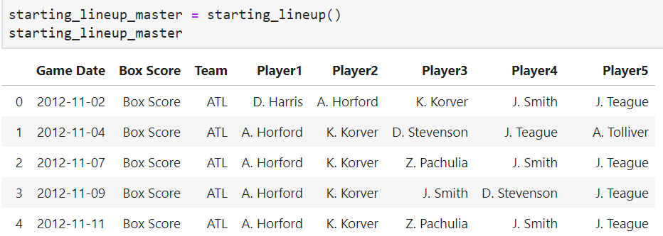
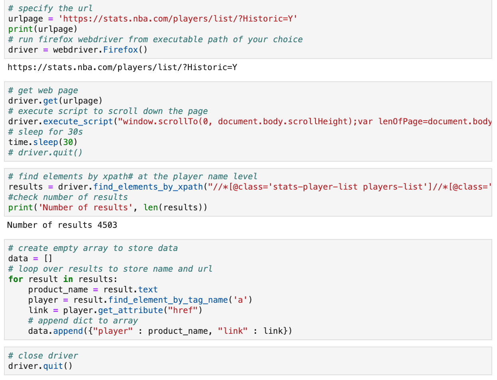
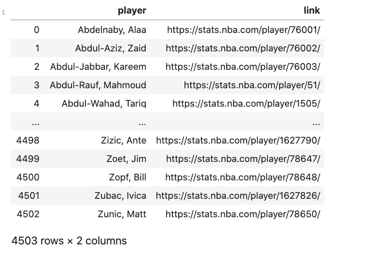
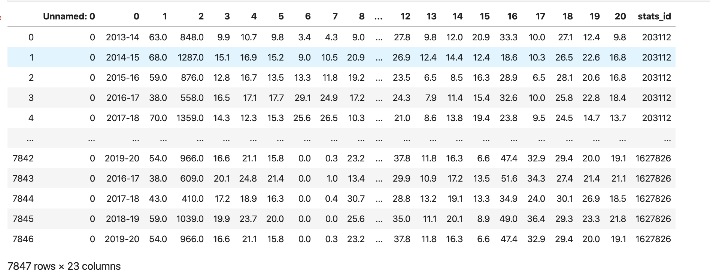
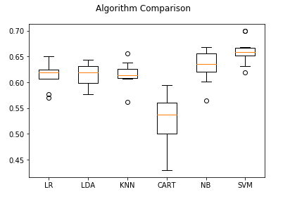
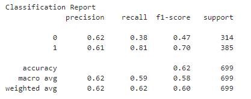
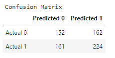

# NBA Predictor 
By: Emmy Kuo, Jennifer Malroy, Ray Yip 


 

## A statistical look into NBA Starting Line Matchups

The sports betting market has been on the rise due to a recent wave of changes to legislation. On the whole, the industry is expected to grow by $8 billion  in the next 5 years.* In order to capitalize on the expected growth, we are using machine learning to predict outcomes in NBA regular season games. 

Since the strength of a team is heavily dependent upon them having star players, we decided to take a player centric approach in predicting matchups. Our training set is comprised of player advanced stats, usage stats and average box scores. The average box scores are calculated by equally weighing the scores from each individual game a home team starter and away team starter were in for a lookback period of 2 years.  

## **Table of Contents**
1. [Data Extraction](#data-extraction)
1. [Data Transformation](#data-transformation)
1. [Data Hosting](#data-on-the-cloud)
1. [Machine Learning Models](#machine-learning-models)
1. [Conclusions](#conclusions)
1. [Future Improvements](#future-improvements)
1. [Resources](#resources)

## **Data Extraction**

There is no shortage of collected statistics in most major league sports; the NBA is no exception. However, much of the data is either not in an easily usable format or behind a paywall. For our dataset, we needed the following:

> Current Starting Lineup (ESPN)

> Current & Historical Game Schedule (Basketball Reference)

> Historical Starting Lineups (Basketball Reference)

> Historical Player Usage Stats (NBA Stats)

> Historical Individual Player Box Scores (Basketball Reference)

We were able to aggregate the data from Basketball Reference, NBA Stats and ESPN using the ```basketball-reference-web-scraper```, ```BeautifulSoup``` and ```selenium```.

**Basketball Reference**

Individual player box scores from 2013-present were available via the  ```basketball-reference``` client. This dataset includes an entry per player per game for over 7 years. In the regular season, each of 30 teams plays 82 games, which means that there are 1,230 games for each regular season. Additionally, there are roughly 70 playoff games each season, depending on how long each team lasts in a 7 game series. For each game, there are roughly 11 players per team who see minutes on the court. Therefore, the player box scores was estimated to be ***approximately 200,200 rows of data*** ([1,230 +70] games * 11 players per team * 2 teams * 7 years). This took approximately 40 minutes to scrape using the API client. Code can be found in the [Data Extraction/clean_data_scrape.ipynb](https://github.com/ekuo651/Project-3/blob/master/Data%20Extraction/clean_data_scrape.ipynb) notebook.

Historical starting lineups for every team is available on the basketball-reference.com website, the data is grouped by season on team webpages, but is not accessible through the API client. The `BeautifulSoup` web scraping tool was used to pull this data. `BeautifulSoup` is a Python library for getting data out of HTML and other markup languages which extracts text from HTML tags, removes the markup, and saves the information by converting the data into an object in Python. 

The URL to access the historical starting lineups is consistent for every team, only changing by the team abbreviation and season year in the link. This made it easy to work with in Python.
<br/>
```
 for i in team_name_list:
        for j in year:  
            url = 'https://www.basketball-reference.com/teams/{}/{}_start.html'.format(i, j)
```

By defining the link format with these two variables and running a for loop through every team and season year using `BeautifulSoup` functions, all of the data for each team and season was extracted to one `DataFrame`. This took approximately two minutes to run. The Code can found in the [Data Extraction/ReferenceLinup.ipynb](https://github.com/ekuo651/Project-3/blob/master/Data%20Extraction/ReferenceLineup.ipynb) notebook.


ATL's starting lineup in the 2013 season


ATL's starting lineup in a pandas DataFrame



Similar to the historical starting lineups, players' advanced stats were extracted using `BeautifulSoup`. The URL format to access every the advanced stats only changes by season year, therefore, the same approach in Python was used to pull in the data. 

Code can be found in the [Data Extraction/adv_stats.ipynb](https://github.com/ekuo651/Project-3/blob/master/Data%20Extraction/adv_stats.ipynb)


Historical game schedules were obtained using the `basketball-reference` client as well. 
Code can be found in the [Data Extraction/season_schedules.ipynb](https://github.com/ekuo651/Project-3/blob/master/Data%20Extraction/season_schedules.ipynb) notebook.

A list of active players were also obtained using the `basketball-reference` client. Code can be found in the [Data Extraction/active_players.ipynb](https://github.com/ekuo651/Project-3/blob/master/Data%20Extraction/active_players.ipynb) notebook.

**NBA Stats**

Player usage can calcuate the amount of time a player is used during the season to see their contribution to the team. The only available place was the larger set of data provided by 'stats.nba.com'. The stats provided by NBA is great and expansive since it is both current and historical. However the website is done by using a Javascript format which BeautifulSoup could not scarpe correctly. In order to get around this we used [`Selenium`](https://selenium-python.readthedocs.io/installation.html#introduction) to handle the task. Code can be found at [Data Extraction/get_stats_nba_id.ipynb](https://github.com/ekuo651/Project-3/blob/master/Data%20Extraction/get_stats_nba_id.ipynb)


Selenium will load each page into a specific webdriver and browswer, read the page and scrape the targeted data similar to BeautifulSoup. 

Exploring how each player's stats URL was created, it was found that the formatting provided that each user had a unique ID.


From there, scarping the index page provided the ID of all users from the history provided by the NBA. 




Merging this historical list of all players with the Active Players list defined earlier, it culled the list down to 1200 players. We then used this list as to start scarping each individual player's usage page for the 7 years of data we are looking for. For looping the URL with the new variable for the season required. Selenium would open each individual's user page and scrape one row of data per season asked. This equated to 7847 pages and data. Because stats.nba.com provided the current season data if URL was incorrect, we needed to remove the duplications in data which left about 7400 rows. 



After cleaning up, the columns and dataframes, we were able to merge this with the other sets of data tied to each user. 

**ESPN Depth Charts**

ESPN Depth Charts webpage provides real-time starting lineups per team. Using `BeautifulSoup`, real-time data is obtained and stored in a `DataFrame` for on-demand predictions. Code can be found in the [Data Extraction/starting_lineup](https://github.com/ekuo651/Project-3/blob/master/Data%20Extraction/starting_lineup.ipynb)


---
## **Data Transformation**

**A Unique Identifier**

Since we needed to calculate box scores of head to head matchup between starters on the two teams, we needed a way to uniquely identify each game. After scraping the NBA schedule, we cleaned the data and assigned each game a unique `game_id`.

**Encoding Player Box Scores**


Since we needed to calculate box scores based on games in common between players, we encoded the `game_id` onto the box scores dataset using a combination of `date`, `team` and `Location`. Due to the fact that games are often started at night one day and stretch into the next day, the dates across the schedule dataset and box score dataset were not consistent. 

To perform a match, we had to define a second date 1 day after the game start date and perform 2 joins of the data. We also split the box score data into 2 data sets to by `HOME` or `AWAY` games. Then we performed two joins on each subset, and used the both teams to filter out the nulls and get the resulting correct `game_id` for each set of box scores. Afterwards, the 2 subsets were reconcatenated. Code can be found in [Data Transformation/encode_box_scores.ipynb](https://github.com/ekuo651/Project-3/blob/master/Data%20Transformation/encode_box_scores.ipynb) notebook.

**Identifying Players by Slugs**

Since our player centric approach relies on having starter data per game, the historical starting lineup dataset formed the backbone of our dataset. From that we were able to extract the `lineup_name` which is in the the following format: `K. Durant`. This was a challenge since it is not a unique identifier for the players, as `D. Wade` could refer to both well-known MVP Dwyane Wade as well as starting rookie Dean Wade. Therefore, we had to explore other options.

Basketball Reference uses an unique identifier for players, the `slug`. It is an alphanumeric string using the first 5 letters of a player's last name, first 2 letters of first name and a number, i.e. `duranke01`. We used the active players dataset, which contained the `slug`, `name` and `year` of a player to form the basis of the `names_all_formats` dataframe. From `name`, we defined the `lineup_name` of each player. However, we also needed to use `year` to match a player. 

After cleaning advanced stats data set, we used a left join to attach a `slug` to each line of player data. However, since there are players who have the exact same name, we needed to ensure that there were no duplicates. To find the duplicates among almost 8,000 lines of data, we first defined a column pre-join to be populated with a unique integer. Post-join, we used `.value_counts()` on that individual series to identify the duplicates. Each set was manually inspected and the wrongly joined line was dropped. 

**Head to Head Stats by Starting Lineup**

Head to head box scores were calculated by first identifying the home and away players of each game. Then each set of lineup_name's were converted to sets of slugs. Afterwards, the sets of slugs were passed into a function to identify the sets of common games between a home team starter and the opposing starting lineup. Finally, a equally weighted set of stats were calculated among the common games for the last 2 years. Code can be found in the scripts and notebooks below. It should be noted that due to key errors in the lineup_name to slug, we had to truncate our dataset to 2328 games instead of 6,000 games. 

`schedule_lineup.py`\
`game_match.py`\
`game_matching.ipynb`

---

## **Data on the Cloud**
To use our models for day to day predictions, we hosted our dataset on the cloud using Amazon Relational Database Service (AWS RDS) and established a connection through Python. Code can be found in the [Data Transformation/tableSQL.ipynb](https://github.com/ekuo651/Project-3/blob/master/Data%20Transformation/tableSQL.ipynb)


**Three tables were created: Advanced Stats by Player, Usage Stats, and Box Scores**


**The data was uploaded using .csv files created during the data extraction process** 


## **Machine Learning Models**

### **Neural Nets**

Initially, we ran a 1 layer neural net on the entire dataset with 2328 entries and 57 features across 5 starters, using a 30% validation split. The results were not promising. The accuracy of both the training and validation sets were fluctuating and did not seem to converge or even reliably trend in any given direction. 

Therefore, we decided to revisit the dataset to see if we could reduce the 'noise'. The calculated box scores, which includes 15 features, did not show many highly correlated features. However, the heatmap produced by looking at the correlation of the entire 57 feature dataset uncovered various highly correlated features.

Looking at the dataset, we could not visually identify which features were the culprits, therefore we wrote a function to detect the features that were highly correlated with at least 3 other features and removed those from the dataset. 

Running the same net after removing the confounding features yielded more intelligible results. The training accuracy and the validation accuracy are trending together, relatively closely. The highest validation accuracy score we were able to achieve was 62%. 


### **Classification** 

The dataset had 57 columns of feature data and 5 starting players per game over a two season period. The `StandardScaler()` was used to pre-process the data and the target data was encoded with 1 and 0 for Win and Loss. The training and testing data was split at 70/30. Supervised machine-learning classification models from the `sklearn` library were used and evaluated in turn with `Kfold` to determine the optimal model by accuracy results. Support Vector Classification (SVC) produced the best results and was used to make predictions. 




**SVC Model Evaluation** 

The SVC model produced an accuracy Score of 62.0%, a true positive rate of 58%, and a true negative of 48%. 



Code can be found in the [Models/Classification.ipynb](https://github.com/ekuo651/Project-3/blob/master/Models/Classification.ipynb) notebook.


## **Conclusions**

We have seen that there is predictive power in using statistics to analyze matchup results. More can, and will, be done to further develop this model. One area that can be improved on is the method of calculating matchup box scores. 

The current method equally weights all games that a player has in common with all the starters of the opposing team, without taking into account the fact that some games have more of the same players in common than others. Additionally, we would like to explore using an exponentially weighted average when calculating to take into account the recentness of the games. 

For this dataset, we only included the home team starters' usage and advanced stats and that team member's matchup scores, which places heavier emphasis on the home team. For future datasets, we would like to explore a more balanced approach in curating the dataset.

## **Future Improvements**
Some future improvements we would like to see for this product is for other users to have a front end environment to use the algortithm to predict future games. We explored using [Anvil](www.anvil.works) a python UI client to start expeirmenting with possibilities along with possible betting odds on the current market for games. 

A true future goal would be to develop a smart contract betting dApp to associate it with our betting favorites. We found samples of other users buiding a shell of a dApp betting system** that would be a model of how we can likely move forward. 

## **Resources**

#### Web Pages:
- https://stats.nba.com
- http://www.espn.com/nba/depth
- https://www.basketball-reference.com

#### Web Scraping Libraries: 

- `BeautifulSoup` with `urllib`
- `Selenium`
- `Basketball Reference Web Scraper`

#### Machine Learning Libraries  

- `sklearn`, `LogisticRegression`, `DecisionTreeClassifier`, `KNeighborsClassifier`, `LinearDiscriminantAnalysis`, `GaussianNB`, `SVC`

---
\* https://www.marketwatch.com/story/firms-say-sports-betting-market-to-reach-8-billion-by-2025-2019-11-04
** https://medium.com/coinmonks/create-a-sports-betting-dapp-on-the-ethereum-blockchain-part-1-1f69f908b939 & https://medium.com/coinmonks/tutorial-create-a-sports-betting-dapp-on-the-ethereum-blockchain-part-2-cd4753afe702


